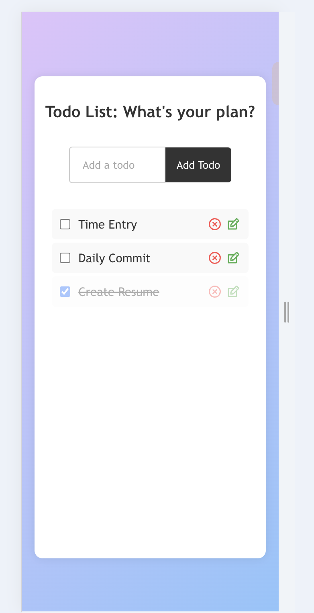

# Todo App

A simple React-based Todo App that allows you to manage your daily tasks efficiently.

## Features

-   Add new tasks
-   Mark tasks as complete
-   Edit existing tasks
-   Delete tasks
-   Todo data is stored in the browser's local storage

## Installation

1. Clone the repository:

```bash
git clone https://github.com/rtCamp/trainee-devansh-chaudhary.git
```

2. Navigate to the project directory:

```bash
cd todo-app
```

3. Install dependencies:

```bash
npm install
```

## Usage

1. Start the development server:

```bash
npm start
```

2. Open your web browser and navigate to `http://localhost:3000`.

3. You can now use the Todo App to manage your tasks.

## Technologies Used

-   React
-   React Icons
-   Local Storage

## Screenshots

### Desktop


### Mobile

